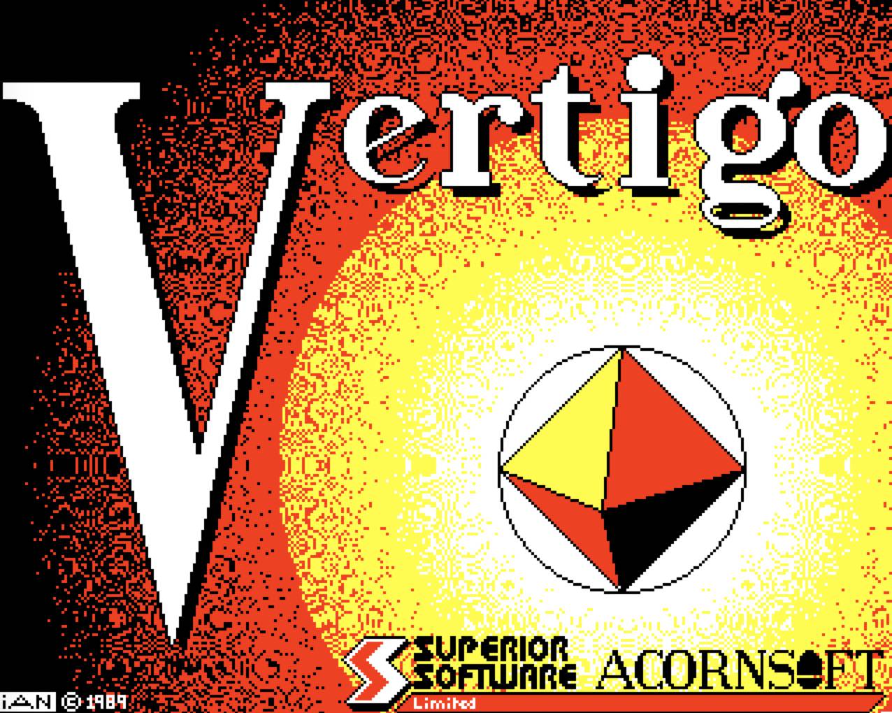

# Vertigo

Full sources for BBC Micro/Electron game "Vertigo" from 1991, as published by Superior Software. Thanks to Richard Hanson at
[Superior Interactive](https://www.superiorinteractive.com/) for permission to release the source code. 

## Original Development Discs
These have been converted and uploaded in the [`original-dev-discs`](original-dev-discs) folder - see [`README.md`](original-dev-discs/README.md) in there for more info.

## Converted Sources
Mapped from ADE+ to beebasm, the 6502 sources are in the [`src`](src) folder, built from the root folder's [`Makefile`](Makefile). This will clone the [`beebasm`](https://github.com/stardot/beebasm) GitHub repository as a sub-folder (if it doesn't already exist), and build `beebasm` if the executable isn't present. The disc image `vertigo.ssd` for Vertigo is then built.

The `clean` make rule will remove the `beebasm` cloned repository and also remove the built disc image `vertigo.ssd`.

### BBC Master variant
* Builds: [`vertigo.ssd`](vertigo.ssd) 
* Original sources: [`Vertigo-BBC-master-backup`](original-dev-discs/Vertigo-master-backup/)
* Rebuilt sources: [`src`](src/)
* Emulated in browser: [`jsbeeb BBC Master disc`](https://bbc.godbolt.org/?model=Master&autoboot&disc=https://raw.githubusercontent.com/dr-grim/vertigo/main/vertigo.ssd) (c/o bbc.godbolt.org)

The code I'd retrieved has the graphics showing `(C) 1989`, so it's not the final disc version (released with `(C) 1991` as its final release date). However, it build a binary match of the executable found on the backup disc, and works 100%. There may have been later tweaks, I'll keep digging.

### BBC 'B' disc variant
* Builds [`vertigo-bbc-b-disc.ssd`](vertigo-bbc-b-disc.ssd)
* Original sources: [`Vertigo-BBC-B-disc`](original-dev-discs/Vertigo-BBC-B-disc/)
* Rebuilt sources: [`src-bbc-b-disc`](src-bbc-b-disc/)
* Emulated in browser: [`jsbeeb BBC 'B' disc`](https://bbc.godbolt.org/?autoboot&disc=https://raw.githubusercontent.com/dr-grim/vertigo/main/vertigo-bbc-b-disc.ssd) (c/o bbc.godbolt.org)

The disc was corrupted, but I managed to retrieve the source code and binary data files. The cassette version sources look ok, so I may be able to rebuild the art from that. Script added to dump files from disc to cassette.

### BBC 'B' cassette variant
* Builds [`vertigo-bbc-b-cassette.ssd`](vertigo-bbc-b-cassette.ssd) which in turn is then used to build [`vertigo-bbc-b-cassette.uef`](vertigo-bbc-b-cassette.uef)
* Original sources: [`Vertigo-BBC-B-cassette`](original-dev-discs/Vertigo-BBC-B-cassette/)
* Rebuilt sources: [`src-bbc-b-cassette`](src-bbc-b-cassette/)
* Emulated in browser: [`jsbeeb BBC 'B cassette`](https://bbc.godbolt.org/?autorun&tape=https://raw.githubusercontent.com/dr-grim/vertigo/main/vertigo-bbc-b-cassette.uef) (c/o bbc.godbolt.org)

Disc read ok, but source code looks incomplete - such as the loader incorrectly using MODE 1 to load a MODE 5 title screen. Otherwise, works fine - albeit is a multi-load implementation (levels are loaded on demand
from cassette). All artwork present with conversion code to downsample from
four color MODE 1 to two colour MODE 4.

### Electron cassette variant
Builds [`vertigo-elecxtron-cassette.ssd`](vertigo-electron-cassette.ssd) which in turn is then used to build [`vertigo-electron-cassette.uef`](vertigo-electron-cassette.uef)
* Original sources: [`Vertigo-electron-cassette`](original-dev-discs/Vertigo-electron-cassette/)
* Rebuilt sources: [`src-electron-cassette`](src-electron-cassette/)
* Emulated in browser: [`jsbeeb Electron cassette - run on a BBC'B'`](https://bbc.godbolt.org/?autorun&tape=https://raw.githubusercontent.com/dr-grim/vertigo/main/vertigo-electron-cassette.uef) (c/o bbc.godbolt.org)

Discs read ok, everything present. Slight technicality in that the original sources used the ADE+ `EMBED` directive to enable me to store code at an address different to what it was compiled for - and for said code to be downloaded to the correct place after loading. The `sprDATA` file to be used for merging into the assembled `Mcode` file looks out of sync with the source code too - so work was needed to get it to build correctly under beebasm.
