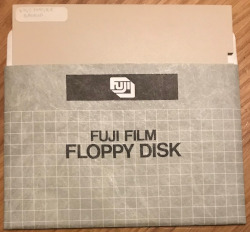
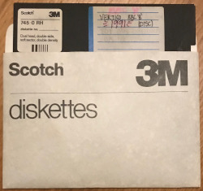

# Vertigo archives

The results of sift and recovering old development discs are noted here.

## Disc synopsis

Each disc is stored in a separate folder; a double-sided DFS disc will have
two sub-folders (`0` and `2`), to represent the drives represented by the disc. However, Opus DDOS discs used sub-volumes to provide further catalogues per disc; these were presented as extra drives, such as `0A`, `0B`, ... , `0H`. These are similarly stored as sub-folders, named after the sub-volume.

The discs were copied to `ADFS` using [DDOS2ADFS](https://github.com/dr-grim/beeb-utils/blob/main/DDOS2ADFS/README.md) and [TreeCopy](https://mdfs.net/Software/FileTools/). The resulting ADFS disc was an image hosted on a GoTEK, which was then ingested via [ADFS Explorer](http://www.g7jjf.com/mac_adfs_explorer.htm). Files were copied into the appropriate folders, with `.INF` files generated to store the execution and load addresses - these were removed where they were unnecessary (e.g. plain text files).

Note that the development machine had an Opus Challenger 3-in-1, which had a 512kB RAM disc. The scripts `SETUP` and `BACKUP` send sub volumes to/from the RAM disc, where the assembly took place. Drive `4` mapped to `0A`, drive 5 to `0B` (256kB each). It madew for a very fast assembly process with ADE+ - we didn't use the object linker, it was fast enough with raw text files. Other projects I used the linker option and it was amazingly fast for an 8-bit machine.

## Discs recovered
Discs recovered are listed below, each disc is in a separate folder.

Disc | Name | Contents
-|-|-
 | [Vertigo master backup](Vertigo-master-backup/) | Backup of BBC Master 128k variant of "Vertigo", bitmaps show "(C) 1989", so older than released copy ("(C) 1991")
 | [Vertigo BBC 'B' disc version](Vertigo-BBC-B-disc/) | The disc (rather than) cassette version for the BBC 'B'; more recent than the BBC Master 128k backup, as bitmaps show "(C) 1991".

## Conversion notes from `ADE+` to `beebasm`

These notes were used to create `convert_6502_src.sh`, which does the heavy lifting from `ADE+` to `beebasm` - the user still has to check and tidy, tho'!

Note that memory addresses for code blocks are left to user to sort out - e.g. `ORG`, `DSECT`, `DEND`, `RESUME` etc. They are commented out by the script, but you may wish to leave them in the source to trigger an error and hence flag where they are.

### Patterns looked for
* Rename `sourcefile` -> `sourcefile.6502`
* Replace `\r` -> `\n` (replace carriage return with line feed for end of line)
* `\n([a-zA-Z])` to `\n.\1` to prepend a `.` on each label
* `\n\s*\*` to `\n;\s*\*` to prepend a `;` on each star-based comment
* `DFB` -> `EQUB`
* `DW` -> `EQUW`
* `DS` -> `SKIP`
* `STR string` -> `EQUS string, &0D` (as MACROs don't support string parameters)
* `ASC` -> `EQUS`
* `^\.(\S+)(\s+)MACRO(\s+)(.*)` -> `\t\tMACRO\t\1\3\4` (start work to map vector definitions - over to user to sort arguments)
* `ENDM` -> `ENDMACRO`
* `CHN(.+)` -> `INCLUDE "\1"`
* `EQU` -> `=`
* `^\.(.+)=(.+)`-> `\1=\2` (remove prepended `.` to a label if its an `=` assignment, we don't need it)
* `TTL` -> comment out (set page title when printing a listing)
* `LST` -> comment out (switches on-screen listing on/off)
* `DSECT` -> comment out (define memory section - let user sort out)
* `DEND` -> comment out (end of memory section - let user sort out)
* `EMBED` -> comment out (changes compilation memory address to that of where it is actually compiled - let user sort out)
* `OBJ` -> comment out (sets compilation address let user sort out)
* negative numbers not supported in immediate mode; use AND &FF to get 8 lsb
* ADE+ and beebasm `>` and `<` operator meanings are flipped (used to perform `MOD` and `DIV` 256), viz:

    Operator | ADE+ | beebasm
    -|-|-
    `>` | MOD 256 | DIV 256
    `<` | DIV 256 | MOD 256

* `>([&a-z0-9A-Z]*)` -> `LO($1)`
* `<([&a-z0-9A-Z]*)` -> `HI($1)`
  